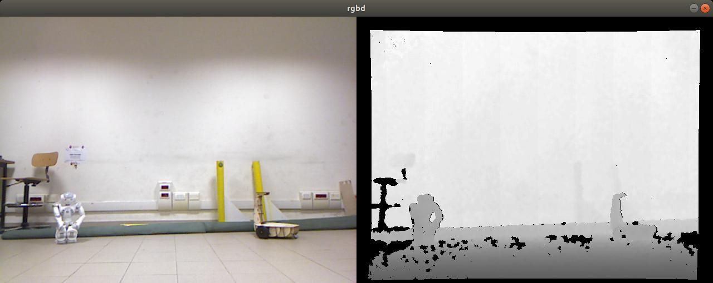

# unibas_viewer
ROS package for reading RGBD data

This code is part of the material of the course [Computer Vision and Machine Perception](http://web.unibas.it/bloisi/corsi/visione-e-percezione.html) - University of Basilicata (Italy)

**This code is provided without any warranty about its usability. It is for educational purposes and should be regarded as such.**

